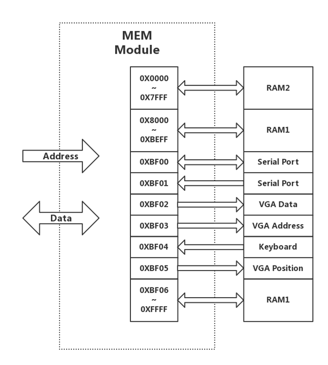
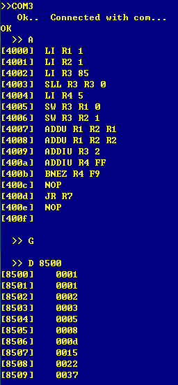
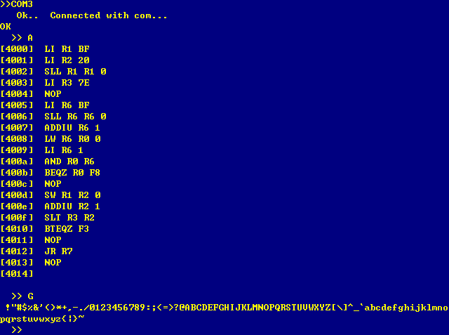
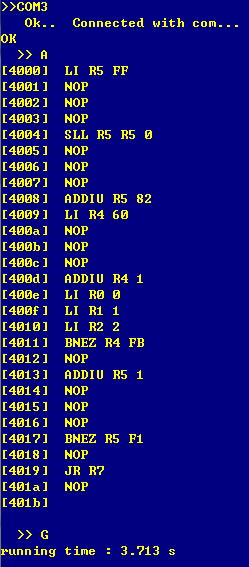
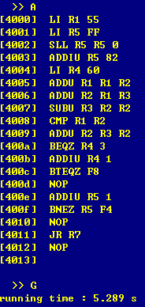
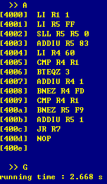
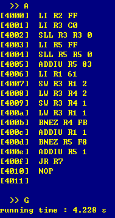
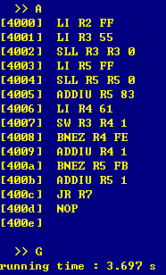

# THCO MIPS 指令计算机系统设计和实现<br>实验报告

计54 徐毅 (2015011334) <br>
计54 李泽龙 (2015011321) <br>
计54 阎世宏 (2015011316)

## 1 实验目标

### 1.1 要求概述

在 THINPAD 教学计算机硬件平台上，设计并实现一个完整的计算机系统，使其能运行教学计算机监控程序，其中 CPU 要求支持五级指令流水，并适当应用数据旁路等提高流水线效率。

### 1.2 具体目标

1. 设计并实现支持五级指令流水的 CPU，指令系统为 THCO MIPS，使其能从 Flash 启动运行教学计算机监控程序，并在监控程序中运行实验一的程序。
2. 使用数据旁路、气泡等方法处理结构冲突、数据冲突、控制冲突，并提高时钟频率，从而提高运行程序的效率 (通过性能测试程序进行检测)。
3. 支持 VGA、键盘外设，从而在监控程序中运行自己的扩展程序 ViMini。

## 2 硬件核心设计

本部分阐述核心的设计思想和解决的技术难点。

### 2.1 数据通路

数据通路可以说是 CPU 运行的骨架所在。针对 THCO MIPS 指令系统设计的数据通路见下页，后面对设计的描述都将以数据通路图为基础进行展开。

<br><br><br><br><br>

对五级流水简要描述如下：

- IF 段：根据当前 PC 从指令内存中取出相应的指令。
- ID 段：对指令进行译码，从寄存器堆中读取需要的数据。
- EX 段：算术逻辑运算 (预测分支不成立，在此段判断分支是否成立，故产生控制信号 PCBranch: 是否通过 B 型指令修改 PC)。
- MEM 段：读写内存 (数据通路图上仅体现为数据内存，也是本段最初的用途，但后续需支持更多操作，将在 2.4 节详细介绍)。
- WB 段：将数据写回寄存器堆。

PC 为指令寄存器，段间 (IF/ID, ID/EX, EX/MEM, MEM/WB) 通过寄存器进行数据传递，段内操作全部使用组合逻辑实现。

### 2.2 指令译码

对指令进行译码是实现指令系统的首要任务。针对 THCO MIPS 指令系统中的所有指令进行的详细分析见下两页。

可以看到，译码单元 (Decoder) 负责产生以下控制信号：

- MemRead: 是否读内存。
- MemWrite: 是否写内存。
- PCToReg: 是否将 PC 的值写入寄存器。
- RegWrite: 是否写寄存器。
- MemToReg: 是否将从内存读出的值写入寄存器。
- PCJump: 是否通过 J 型指令修改 PC。
- ALUOp: ALU 进行何种运算，一类是常规运算，结果为运算结果 ALUResult，包括 ALUOp\_ADD (加法), ALUOp\_SUB (减法), ALUOp\_AND (与), ALUOp\_OR (或), ALUOp\_SLL (逻辑左移), ALUOp\_SRA (算术右移), ALUOp\_SLT (是否有符号小于), ALUOp\_SLTU (是否无符号小于), ALUOp\_SNE (是否不等)；一类是判断分支是否成立，结果为控制信号 PCBranch，包括 ALUOp\_BNOP (分支无), ALUOp\_BEQZ (分支等于零), ALUOp\_BNEZ (分支不等于零)。
- ALUSrc: ALU 的第二个操作数来自寄存器 (ALUSrc\_REG) 还是扩展过的立即数 (ALUSrc\_IMMEDIATE)。

除控制信号外，译码单元还负责提取出指令中的读寄存器 1 编号 (ReadRegister1), 读寄存器 2 编号 (ReadRegister2), 写寄存器编号 (WriteRegister)，并得出按不同指令要求 (符号扩展 / 零扩展 / 遇 0 变 8) 扩展过的立即数 (ExtendedImmediate)。这些提取出的东西都将借助寄存器流动到后面的流水段，直至其不再需要被使用。

需要说明的是，除 0 ~ 7 号寄存器外，SP, T, IH 也分别被编为 8, 9, 10 号寄存器，方便统一处理。此外还设置了一个编号作为常量零寄存器。

对于操作数为单寄存器的指令，认为其进行的运算为寄存器与立即数 0 相加。对于操作数为单立即数的指令，认为其进行的运算为常量零寄存器与立即数相加。

### 2.3 冲突处理

由于使用了五级流水，指令间会存在冲突，必须正确地处理这些冲突才能使 CPU 正常运行。

#### 数据旁路

有一类数据冲突可由数据旁路 (Forwarding) 解决，将产生以下控制信号：

- Forward1: 寄存器 1 的真实值来源于 ID 段读寄存器 1 的值 (FORWARD\_ID2EX) / MEM 段保存的 ALU 运算结果 (FORWARD\_EX2MEM) / WB 段算出写回寄存器的值 (FORWARD\_MEM2WB)。
- Forward2: 寄存器 2 的真实值来源于 ID 段读寄存器 2 的值 (FORWARD\_ID2EX) / MEM 段保存的 ALU 运算结果 (FORWARD\_EX2MEM) / WB 段算出写回寄存器的值 (FORWARD\_MEM2WB)。

#### 气泡

其余冲突都需要借助冒险检测 (HazardDetection) 产生气泡解决，将产生以下控制信号：

- PCWrite: 是否写入 PC。
- IF2ID\_Write: 是否写入 IF/ID 寄存器。
- IF2ID\_Flush: 是否将 IF/ID 寄存器清空。
- ID2EX\_Flush: 是否将 ID/EX 寄存器清空。
- EX2MEM\_Flush: 是否将 EX/MEM 寄存器清空。

冲突具体如下：

- 另一类数据冲突：ID 段发现当前指令需读的寄存器正是上条指令将把读内存的结果写回的，此时要将当前指令推迟一条执行，故影响控制信号 PCWrite, IF2ID\_Write, ID2EX\_Flush。
- 结构冲突：在 MEM 段读写指令内存，此时要停掉已经载入的后三条指令，故影响控制信号 PCWrite, IF2ID_Flush, ID2EX\_Flush, EX2MEM\_Flush，此外还会影响对 PC 的修改。
- 控制冲突：EX 段发现预测分支不成立但预测失败 (即分支成立，PCBranch = '1') 或是遇到跳转 (PCJump = '1') 时，需将已经载入的后面第二条 (后面第一条是延迟槽，必被执行) 指令停下，故影响控制信号 IF2ID_Flush。

<br><br><br><br><br><br><br><br><br><br>

### 2.4 真正的 MEM 段——存储与 I/O

在 MEM 段所要处理的远远不止数据内存。各类访问均统一到内存编址中，在 MEM 段交由对应实际设备的驱动处理，下面结合编址图分别阐述。



#### 串口

为跑监控程序，必须支持串口通信，要求以 0xBF00 作为串口数据，0xBF01 作为串口准备信号。

对串口的控制需要一些技巧，控制信号通过对 CPU 运行时钟进行组合逻辑得到，从而利用 CPU 运行时钟的上升 / 下降沿完成控制信号的拉高 / 拉低 (内存类似)。

由于在硬件平台上串口与 RAM1 共用总线，实现时将 RAM1 用作数据内存。

#### 指令内存

指令内存的读写是必须支持的，对于监控程序地址划分中的程序区 0x0000 ~ 0x7FFF，移交指令内存处理，同时触发结构冲突。

实现时将 RAM2 用作指令内存。

#### 键盘

为跑自己的扩展程序 ViMini，需支持键盘外设。

键盘驱动所要做的，就是从 PS2 接口读取键盘数据，并将当前按键状态映射到内存地址 0xBF04，以供程序读取。

#### VGA

为跑自己的扩展程序 ViMini，需支持 VGA 外设。

考虑在 VGA 显示 30 行 80 列的文本编辑器。首先需要一块 VGARAM 存储每格的字符，其次需要一块 CharPicROM 存储各字符各像素的颜色分量 (在 3.2.5 节详细介绍)。此外还需要一个左上至右下用 0 至 2399 编号的闪烁光标坐标。

程序操作时，将 0xBF02 用于传递写入 VGARAM 的数据，0xBF03 用于传递写入 VGARAM 的地址，0xBF05 用于传递当前闪烁光标位置。

### 2.5 从 Flash 启动

为使该计算机更加真实，增加其从 Flash 启动的功能，即从 Flash 中读取监控程序并写入指令内存 RAM2，再进入运行模式。Flash 的读取可以使用一个状态机来完成，但由于 Flash 的延时约 120 ns，此阶段需要一个单独的 6.25M 时钟。

### 2.6 CPU 主频提升

启动完毕后就进入了 CPU 正常运行的阶段。为提高运行程序的效率，需要最大限度地提高 CPU 运行的频率。而 CPU 运行的频率，受到了流水段内延时的限制 (段内均是组合逻辑)。

显然，延时最大的是 MEM 段，在对应的多种实际设备中需要考虑的是内存和串口。二者的控制信号都依靠了时钟下降沿用组合逻辑实现。经过测试，时钟低电平需要保持 15 ns 才能保证读写正常。

要想使 CPU 运行的频率达到 50 MHz，每个周期的时间只有 20 ns。也就是，我们需要让时钟高电平只保持 5 ns。这是可以做到的，我们对 200M 时钟利用状态机进行“高 : 低 = 1 : 3”的分频即可。

然而事实上这样做是有问题的，原因是内存和串口的访问时序不同，内存在控制信号下降沿开始写入，作为写入结束标志的上升沿到来后几乎不需保持时间；串口在控制信号下降沿将数据送往发送器，上升沿到来后才真正发送，需要一定时间 (5 ns 并不够) 才能完成发送。

这也是可以解决的，原因是下降沿到来后数据送往发送器和上升沿到来后真正发送都能在 10 ns 内完成，故我们对 200M 时钟利用状态机进行“高 : 低 : 高 = 1 : 2 : 1”的分频即可。

然而当将键盘信号接入后，串口控制信号出现了不稳定的情况 (二者都经过了 CPLD)，最终选择改变原始时钟为 190M，从而得到 47.5MHz 的 CPU 运行频率。

至于 190M 时钟的获得，使用 ISE 生成 Single DCM_SP 型 IP 即可。

## 3 硬件具体实现

本部分结合项目中各主要模块的代码来解释具体的实现方法。

### 3.1 常量设计 (Definitions.vhd)

常量定义在 Definitions 包中，包括各种控制信号 (ALUOp, ALUSrc, FORWARD)、寄存器编号 (REG)、键盘字符编号 (key) 以及一些数字常量 (NOP 指令, PC 初值, 立即数 0, FLASH 中读取指令数等)，方便代码编写。

### 3.2 元件设计 (Components.vhd)

元件定义在 Components 包中，包括以下部分。

#### 3.2.1 调试部分

即为了方便调试而设计的元件。

##### Digital7.vhd

即课程《数字逻辑实验》中的“点亮数字人生”，将 1 位 16 进制数用七段数码管显示。

```vhdl
entity Digital7 is
    port (
        key: in std_logic_vector(3 downto 0); --数据输入
        display: out std_logic_vector(6 downto 0) --七段数码管输出
    );
end Digital7;
```

##### FakeMemory.vhd

假内存，在上板子之前根据不同的 PC 返回所编写的指令。

```vhdl
entity FakeMemory is
    port (
        MemRead: in std_logic;
        MemWrite: in std_logic;
        Address: in std_logic_vector(15 downto 0);
        WriteData: in std_logic_vector(15 downto 0);
        ReadData: out std_logic_vector(15 downto 0)
    );
end FakeMemory;
```

#### 3.2.2 时钟部分

##### ClkGen.vhd

由 ISE 生成的 Single DCM_SP 型 IP，将输入的 50M 时钟倍频至 190M 输出，同时产生一个反射的 50M 时钟。

```vhdl
entity ClkGen is
    port ( CLKIN_IN        : in    std_logic; --输入时钟
           CLKFX_OUT       : out   std_logic; --输出时钟
           CLKIN_IBUFG_OUT : out   std_logic; --反射输入时钟
           CLK0_OUT        : out   std_logic);
end ClkGen;
```

#### 3.2.3 寄存器部分

即在各段流水之间传递数据使用的寄存器。

##### Reg.vhd

1 位寄存器，默认值为 0。有写使能，可同步置默认值。

```vhdl
component Reg
    port (
        Clk: in std_logic;
        Flush: in std_logic; --是否同步置默认值
        WriteEnable: in std_logic; --写使能
        DataIn: in std_logic; --写入数据
        DataOut: out std_logic := '0' --读出数据
    );
end component;
```

##### RegVector4.vhd

4 位寄存器向量，默认值可在例化时指定。有写使能，可同步置默认值。

```vhdl
component RegVector4 is
    generic (
        DataInitial: std_logic_vector(3 downto 0) --默认值
    );
    port (
        Clk: in std_logic;
        Flush: in std_logic; --是否同步置默认值
        WriteEnable: in std_logic; --写使能
        DataIn: in std_logic_vector(3 downto 0); --写入数据
        DataOut: out std_logic_vector(3 downto 0) := DataInitial --读出数据
    );
end component;
```

##### RegVector16.vhd

16 位寄存器向量，默认值可在例化时指定。有写使能，可同步置默认值。

```vhdl
component RegVector16 is
    generic (
        DataInitial: std_logic_vector(15 downto 0) --默认值
    );
    port (
        Clk: in std_logic;
        Flush: in std_logic; --是否同步置默认值
        WriteEnable: in std_logic; --写使能
        DataIn: in std_logic_vector(15 downto 0); --写入数据
        DataOut: out std_logic_vector(15 downto 0) := DataInitial --读出数据
    );
end component;
```

#### 3.2.4 主组件部分

即主要的被独立出来的几个组件。

##### Registers.vhd

寄存器堆。由于有效的寄存器只编到 10 号，若访问超过 10 号的寄存器，会取出 0。这样，只要给常量零寄存器一个超过 10 号的编号即完成了对它的实现。

```vhdl
component Registers is
    port (
        Clk: in std_logic;
        RegWrite: in std_logic;
        ReadRegister1: in std_logic_vector(3 downto 0);
        ReadRegister2: in std_logic_vector(3 downto 0);
        WriteRegister: in std_logic_vector(3 downto 0);
        WriteData: in std_logic_vector(15 downto 0);
        ReadData1: out std_logic_vector(15 downto 0);
        ReadData2: out std_logic_vector(15 downto 0)
    );
end component;
```

##### Decoder.vhd

译码单元，在前面已有详细说明。

```vhdl
component Decoder is
    port (
        ins       : in  STD_LOGIC_VECTOR (15 downto 0);
        ALUOp     : out STD_LOGIC_VECTOR (3 downto 0);
        ALUSrc    : out STD_LOGIC;
        MemRead   : out STD_LOGIC;
        MemWrite  : out STD_LOGIC;
        PCToReg   : out STD_LOGIC;
        RegWrite  : out STD_LOGIC;
        MemToReg  : out STD_LOGIC;
        PCJump    : out STD_LOGIC;
        ReadReg1  : out STD_LOGIC_VECTOR (3 downto 0);
        ReadReg2  : out STD_LOGIC_VECTOR (3 downto 0);
        WriteReg  : out STD_LOGIC_VECTOR (3 downto 0);
        Immediate : out STD_LOGIC_VECTOR (15 downto 0)
    );
end component;
```

<br>

##### ALU.vhd

算术逻辑运算单元。负责根据控制信号 ALUOp 进行运算以及产生控制信号 PCBranch。

```vhdl
component ALU is
    port (
        in_data1  : in  STD_LOGIC_VECTOR (15 downto 0); --输入数据1
        in_data2  : in  STD_LOGIC_VECTOR (15 downto 0); --输入数据2
        ALUOp     : in  STD_LOGIC_VECTOR (3 downto 0);
        ALUResult : out STD_LOGIC_VECTOR (15 downto 0);
        Branch    : out STD_LOGIC
    );
end component;
```

#### 3.2.5 外设部分

即与外设相关的几个组件。

##### Keyboard.vhd

键盘驱动单元。内部使用状态机处理按键状态，支持 Shift 的上档切换键功能。

```vhdl
component Keyboard is
    port (
        KeyboardData: in std_logic; --键盘数据
        KeyboardClk: in std_logic; --键盘时钟
        FilterClk5M: in std_logic; --滤波5M时钟
        KeyboardOut: out std_logic_vector(7 downto 0) --当前按键状态
    );
end component;
```

##### VGA.vhd

VGA 驱动单元。分辨率为 640 × 480。通过 VGARAM 获取像素位置对应的字符，通过 CharPicROM 确定像素位置的颜色分量。

```vhdl
component VGA is
    port (
        clk     : in  STD_LOGIC;                      --25M 时钟
        rst     : in  STD_LOGIC;                      --复位键
        PicData : in  STD_LOGIC_VECTOR (9 downto 0);  --当前像素对应字符内位置颜色分量
        CharData: in  STD_LOGIC_VECTOR (7 downto 0);  --当前像素对应字符
        Pos     : in  STD_LOGIC_VECTOR (11 downto 0); --当前闪烁光标坐标
        CharAddr: out STD_LOGIC_VECTOR (11 downto 0); --当前像素对应字符 VGARAM 地址
        PicAddr : out STD_LOGIC_VECTOR (13 downto 0); --当前像素对应字符内位置
                                                      --对应 CharPicROM 地址
        Red     : out STD_LOGIC_VECTOR (2 downto 0);  --当前像素红色分量
        Green   : out STD_LOGIC_VECTOR (2 downto 0);  --当前像素绿色分量
        Blue    : out STD_LOGIC_VECTOR (2 downto 0);  --当前像素蓝色分量
        Hs      : out STD_LOGIC;                      --行同步信号
        Vs      : out STD_LOGIC                       --场同步信号
    );
end component;
```

##### CharPicROM.vhd

由 ISE 生成的 Block Memory Generator 型 IP (单口)，字符图片只读存储器模块。该存储器保存了各个字符在各个像素位置的颜色分量，在时钟信号的控制之下，通过地址输入来获取相应的颜色分量。

```vhdl
component CharPicROM is
    port (
        clka : IN STD_LOGIC; --50M 时钟
        addra : IN STD_LOGIC_VECTOR(13 DOWNTO 0); --输入字符某个像素位置
        douta : OUT STD_LOGIC_VECTOR(9 DOWNTO 0)  --输出该位置的颜色分量
    );
end component;
```

##### VGARAM.vhd

由 ISE 生成的 Block Memory Generator 型 IP (双口)，VGA 文本存储器模块。该文本模块初值为全 0，在时钟信号控制之下，一端可以修改指定位置的字符，另一端可以获取指定位置的字符。

```vhdl
component VGARAM is
    port (
        clka : IN STD_LOGIC;                      --写时钟 (CPU 运行)
        wea : IN STD_LOGIC_VECTOR(0 DOWNTO 0);    --写使能
        addra : IN STD_LOGIC_VECTOR(11 DOWNTO 0); --写入地址
        dina : IN STD_LOGIC_VECTOR(7 DOWNTO 0);   --写入字符
        clkb : IN STD_LOGIC;                      --读时钟 (25M)
        addrb : IN STD_LOGIC_VECTOR(11 DOWNTO 0); --读取地址
        doutb : OUT STD_LOGIC_VECTOR(7 DOWNTO 0)  --读取字符
    );
end component;
```

### 3.3 主模块设计 (RippleCPU.vhd)

作为顶层模块，首先看其外在——顶层信号。

```vhdl
entity RippleCPU is
    port (
        Clk50M: in std_logic; --50M时钟输入
        Clk11M: in std_logic; --11M时钟输入
        ClkHand: in std_logic; --手按时钟
        KeyboardClk: in std_logic; --键盘时钟
        KeyboardData: in std_logic; --键盘数据
        Rst: in std_logic; --RST输入
        TBRE: in std_logic; --串口发送数据信号
        TSRE: in std_logic; --串口数据发送完毕信号
        DataReady: in std_logic; --串口数据准备信号
        WRN: out std_logic; --串口写
        RDN: out std_logic; --串口读
        Ram1OE: out std_logic; --RAM1读
        Ram1WE: out std_logic; --RAM1写
        Ram1EN: out std_logic; --RAM1使能
        Ram1Addr: out std_logic_vector(17 downto 0); --RAM1地址
        Ram1Data: inout std_logic_vector(15 downto 0); --RAM1数据
        Ram2OE: out std_logic; --RAM2读
        Ram2WE: out std_logic; --RAM2写
        Ram2EN: out std_logic; --RAM2使能
        Ram2Addr: out std_logic_vector(17 downto 0); --RAM2地址
        Ram2Data: inout std_logic_vector(15 downto 0); --RAM2数据
        FlashByte: out std_logic;  --Flash操作模式
        FlashVpen: out std_logic; --Flash写保护
        FlashCE: out std_logic; --Flash使能
        FlashOE: out std_logic := '1'; --Flash读
        FlashWE: out std_logic := '1'; --Flash写
        FlashRP: out std_logic; --Flash工作
        FlashAddr: out std_logic_vector(22 downto 0); --Flash地址
        FlashData: inout std_logic_vector(15 downto 0); --Flash数据
        Red: out std_logic_vector(2 downto 0); --VGA红色分量
        Green: out std_logic_vector(2 downto 0); --VGA绿色分量
        Blue: out std_logic_vector(2 downto 0); --VGA蓝色分量
        Hs: out std_logic; --VGA行同步信号
        Vs: out std_logic; --VGA场同步信号
        DYP1: out std_logic_vector(6 downto 0); --七段数码管
        DYP0: out std_logic_vector(6 downto 0); --七段数码管
        L: out std_logic_vector(15 downto 0) --发光二极管
    );
end RippleCPU;
```

再看内部实现。主模块主要实现的是数据通路，即将已有的元件例化并进行连接。

此外还有以下部分，分别介绍。

<br>

#### 3.3.1 调试部分

将要输出的内容 (如键盘按键状态) 分别连到两个七段数码管，将要输出的内容 (如当前指令) 连到发光二极管以便调试。

#### 3.3.2 时钟部分

核心部分 (在 2.6 节说明) 为：

```vhdl
DivideClkMagic: process (Clk200M)
    variable Count: integer := 0;
begin
    if rising_edge(Clk200M) then
        Count := Count + 1;
        if Count = 1 then
            ClkMagic <= '0';
            ClkSerial <= '0';
        elsif Count = 3 then
            ClkSerial <= '1';
        elsif Count = 4 then
            ClkMagic <= '1';
            Count := 0;
        end if;
    end if;
end process;
```

其余即为将 50M 时钟分频给各种不同时钟需求使用。

#### 3.3.3 从 Flash 启动部分

在前面已有详细说明。

#### 3.3.4 RAM2 部分

在前面已有详细说明。

#### 3.3.5 RAM1 部分

在前面已有详细说明。

#### 3.3.6 数据旁路部分

在前面已有详细说明。

<br>

#### 3.3.7 冒险检测部分

在前面已有详细说明。

#### 3.3.8 异步 Reset 转同步 Flush 部分

所有的寄存器只会同步置默认值，IF2ID\_Flush, ID2EX\_Flush, EX2MEM\_Flush 都受到全局 Reset 信号 Global\_Flush 的影响，PC 和 MEM2WB 寄存器则直接以 Global\_Flush 作为 Flush 信号。

按下 RST 键时，置 Global\_Flush 为 1；当时钟上升沿到来时，置 Global\_Flush 为 0，从而实现了异步 Reset 转同步 Flush。

当然，启动前 Global\_Flush 始终为 1。

## 4 软件设计与成果展示

### 4.1 实验一程序

#### 4.1.1 Fibonacci

求前 10 个 Fibonacci 数，将结果保存到起始地址为 0x8500 的连续 10 个字中。

```asm
LI R1 1       ; 寄存器R1记录第一个Fibonacci数
LI R2 1       ; 寄存器R2记录第二个Fibonacci数
LI R3 85
SLL R3 R3 0   ; 初始地址为0x8500
LI R4 5       ; 计数器初值为10 / 2 = 5
SW R3 R1 0    
SW R3 R2 1    ; 在内存中存下算出的两个Fibonacci数
ADDU R1 R2 R1 ; R1 = R1 + R2
ADDU R1 R2 R2 ; R2 = R1 + R2 = (原R1 + R2) + R2
ADDIU R3 2    ; 每次计算出两个Fibonacci数，地址加2
ADDIU R4 FF   ; 计数器 - 1
BNEZ R4 F9    ; R4值不为0时，跳转至SW R3 R1 0，否则退出循环
NOP
JR R7
NOP
```

结果截图如下：



#### 4.1.2 ASCII

将 ASCII 可见字符表在终端上输出。

```asm
LI R1 BF
LI R2 20    ; 第一个能打印的字符值为 0x20 (空格)
SLL R1 R1 0 ; 将串口地址 0xBF00 存入 R1
LI R3 7E    ; 最后一个能打印的字符值为 0x7E
NOP
LI R6 BF
SLL R6 R6 0
ADDIU R6 1
LW R6 R0 0
LI R6 1
AND R0 R6
BEQZ R0 F8  ; 以上部分检测串口是否可写，如不可写返回至之前的 NOP 语句
NOP
SW R1 R2 0  ; 打印当前字符值表示的字符
ADDIU R2 1  ; 当前打印的字符值 + 1
SLT R3 R2   ; 比较当前打印字符值是否超过 0x7E
BTEQZ F3    ; T = 0 时，跳到前一个 NOP 语句继续执行，否则退出循环
NOP
JR R7
NOP
```

结果截图如下：



### 4.2 性能测试程序

使用了提供的性能测试程序。

#### 4.2.1 性能标定

主要循环体 0x0D ~ 0x12 (6 条)，每条各执行 25,000,000 次，共 1.5 亿条指令。

由于我们预测分支不成立，预测失败导致插入一个气泡，也即主要循环体变为 7 条，实际执行 1.75 亿条指令 (CPI = 1.17)，对应我们的时钟频率 47.5 MHz 估计结果为 3.68 s，与实际结果相符：



#### 4.2.2 运算数据冲突的效率测试

主要循环体 0x05 ~ 0x0D (9 条)，每条各执行 25,000,000 次，共 2.25 亿条指令。

由于我们预测分支不成立，预测失败导致插入一个气泡，也即主要循环体变为 10 条，实际执行 2.5 亿条指令 (CPI = 1.11)，对应我们的时钟频率 47.5 MHz 估计结果为 5.26 s，与实际结果相符：



#### 4.2.3 控制指令冲突测试

主要循环体 0x06 ~ 0x09 (4 条)，每条各执行 25,000,000 次，共 1 亿条指令。

由于我们预测分支不成立，预测失败导致插入一个气泡，也即主要循环体变为 5 条，实际执行 1.25 亿条指令 (CPI = 1.25)，对应我们的时钟频率 47.5 MHz 估计结果为 2.63 s，与实际结果相符：



#### 4.2.4 访存数据冲突性能测试

主要循环体 0x07 ~ 0x0C (6 条)，每条各执行 25,000,000 次，共 1.5 亿条指令。

由于我们预测分支不成立，预测失败导致插入一个气泡，另一类数据冲突导致插入一个气泡，也即主要循环体变为 8 条，实际执行 2 亿条指令 (CPI = 1.33)，对应我们的时钟频率 47.5 MHz 估计结果为 4.21 s，与实际结果相符：



#### 4.2.5 读写指令存储器测试

主要循环体 0x07 ~ 0x09 (3 条)，每条各执行 25,000,000 次，共 0.75 亿条指令。

由于我们预测分支不成立，预测失败导致插入一个气泡，结构冲突导致插入三个气泡，也即主要循环体变为 7 条，实际执行 1.75 亿条指令 (CPI = 2.33)，对应我们的时钟频率 47.5 MHz 估计结果为 3.68 s，与实际结果相符：



### 4.3 扩展程序 ViMini

ViMini 是一个简单的文本编辑器，提供了写入、退格、换行、清屏、退出功能。

- 写入：写入字符到当前光标位置，光标后移一格。支持主键盘区的所有可见字符，支持 Shift 作为上档切换键。
- 退格：删除当前光标位置字符，光标前移一格。
- 换行：使用换行功能键 (设置为 Enter 键)，将光标切换至下行行首。
- 清屏：使用清屏功能键 (设置为 Delete 键)，清空屏幕。
- 退出：使用退出功能键 (设置为 Esc 键)，退出程序。

```asm
INIT: LI R0 0               ; 初始化 R0: 上次读取的按键
LI R1 0                     ; R1: 当前读取的按键
LI R2 0                     ; R2: 当前光标位置（距离左上角的距离）
LI R3 0                     ; R3: 当前光标列号（距离本行左侧的距离）
CLEARSCREEN: LI R4 9        ; CLEARSCREEN: 清空整个屏幕
SLL R4 R4 0                 ; 设置 R4 为整个屏幕的字符总数 0x960
ADDIU R4 60
CLEARCHAR: SUBU R4 R2 R5    ; 判断当前光标位置是否到达右下角
BEQZ R5 SETCURSORLEFTTOP    ; 到达右下角，清屏结束，跳至 SETCURSORLEFTTOP
NOP
LI R5 BF                    ; 将当前光标位置的字符置为空
SLL R5 R5 0
SW R5 R1 2
SW R5 R2 3
ADDIU R2 1                  ; 移动光标到下一个位置
B CLEARCHAR                 ; 跳转到 CLEARCHAR 判断是否清屏完毕
NOP
SETCURSORLEFTTOP: LI R2 0   ; 将光标移至左上角
LI R5 BF
SLL R5 R5 0
SW R5 R2 5
GETCURRENTKEY: MOVE R0 R1   ; 用当前按键的值覆盖上次按键的值
LI R5 BF                    ; 读取当前按键
SLL R5 R5 0
LW R5 R1 4
SUBU R0 R1 R5               ; 判断当前按键与上次按键是否相同
BEQZ R5 GETCURRENTKEY       ; 如果相同，说明按键没有改变，跳至 GETCURRENTKEY 继续读取
NOP
BEQZ R1 GETCURRENTKEY       ; 如果当前按键为 0，没有键按下，跳至 GETCURRENTKEY 继续读取
NOP
LI R5 60                    ; 判断当前按键是否为可见字符
SLTU R1 R5
BTEQZ E                     ; 当前按键不是可见字符，跳至 JUDGEBKSP 判断是否为退格键
NOP
LI R4 4F                    ; 当前按键是可见字符，判断当前光标位置是否到达本行行尾
CMP R3 R4
BTEQZ GETCURRENTKEY         ; 如果到达行尾，不写入当前字符，跳至 GETCURRENTKEY 继续读取
NOP
ADDIU R3 1                  ; 当前光标列号 +1
LI R5 BF                    ; 写入当前字符
SLL R5 R5 0
SW R5 R1 2
SW R5 R2 3
ADDIU R2 1                  ; 当前光标位置 +1
SW R5 R2 5
B GETCURRENTKEY             ; 当前按键作为可见字符处理完毕，跳至 GETCURRENTKEY 继续读取
NOP
JUDGEBKSP: LI R5 60         ; 判断当前按键是否为退格键
SUBU R5 R1 R5
BNEZ R5 JUDGECLEARSCREEN    ; 当前按键不是退格键，跳至 JUDGECLEARSCREEN 判断是否为清屏键
NOP
LI R4 0                     ; 当前按键是退格键，判断是否到达行首
CMP R3 R4
BTEQZ GETCURRENTKEY         ; 如果到达行首，不执行退格，跳至 GETCURRENTKEY 继续读取
NOP
ADDIU R3 FF                 ; 当前光标列号 -1
LI R5 BF                    ; 清空当前字符
SLL R5 R5 0
ADDIU R2 FF                 ; 当前光标位置 -1
SW R5 R2 5
SW R5 R1 2 
SW R5 R2 3
B GETCURRENTKEY             ; 当前按键作为退格键处理完毕，跳至 GETCURRENTKEY 继续读取
NOP
JUDGECLEARSCREEN: LI R5 69  ; 判断当前按键是否为清屏键
SUBU R5 R1 R5
BNEZ R5 JUDGEEXIT           ; 如果当前按键不是清屏键，跳至 JUDGEEXIT 判断是否为退出键
NOP
B INIT                      ; 当前按键是清屏键，跳至 INIT 执行初始化与清屏
NOP
JUDGEEXIT: LI R5 68         ; 判断当前按键是否为退出键
SUBU R5 R1 R5
BNEZ R5 JUDGEENTER          ; 如果当前按键不是退出键，跳至 JUDGEENTER 判断是否为换行键
NOP
B QUIT                      ; 当前按键是退出键，跳至 QUIT 退出
NOP
JUDGEENTER: LI R5 61        ; 判断当前按键是否为换行键
SUBU R5 R1 R5
BNEZ R5 NEXT                ; 如果不是换行键，跳至 NEXT 准备下一个判断
NOP
LI R4 50                    ; 计算当前行剩余空字符数量
SUBU R4 R3 R4
ADDU R2 R4 R2               ; 将当前光标位置移至下行行首
LI R3 0                     ; 将当前光标列号置 0
LI R5 BF                    ; 更新光标位置给 VGA
SLL R5 R5 0
SW R5 R2 5
B GETCURRENTKEY             ; 当前按键作为换行键处理完毕，跳至 GETCURRENTKEY 继续读取
NOP
NEXT: B GETCURRENTKEY       ; 预留给其他按键类型判断的位置，跳至 GETCURRENTKEY 继续读取
NOP
QUIT: JR R7
NOP
```

可以看到汇编代码中 B 型指令使用了标号进行跳转 (方便代码编写)。我们实现了一个简易的汇编预处理器，可将标号转为实际应填入的值，从而得以运行。

ViMini 的演示见视频 ViMini.mp4。

## 5 心得体会

1. 前期准备：前期的内存串口实验，以及实验指导书中提供的 VGA、键盘、Flash 实验等，为我们摸清这些设备提供了很好的指导，在此基础上将这些设备驱动融入到计算机中就非常得心应手；教材上对数据通路的讲解非常清晰，理解后画自己的数据通路也就没有任何障碍了。
2. 分工合作：给每位组员安排合适的工作内容，保证随时有至少一个人在工作，从而使项目持续推进。
3. 敢于尝试：对于最终能将 CPU 运行频率提高到 47.5 MHz 的结果，我们也是没有预期的，需要不停地大开脑洞并不断尝试，不轻易放弃，才能得到这样满意的结果。
4. 鼓足干劲：大实验绝对不能拖，需要卯足了劲干，定下目标就去做，该刷夜刷夜，最终得知我们是全年级第一个检查的时候真的非常激动。